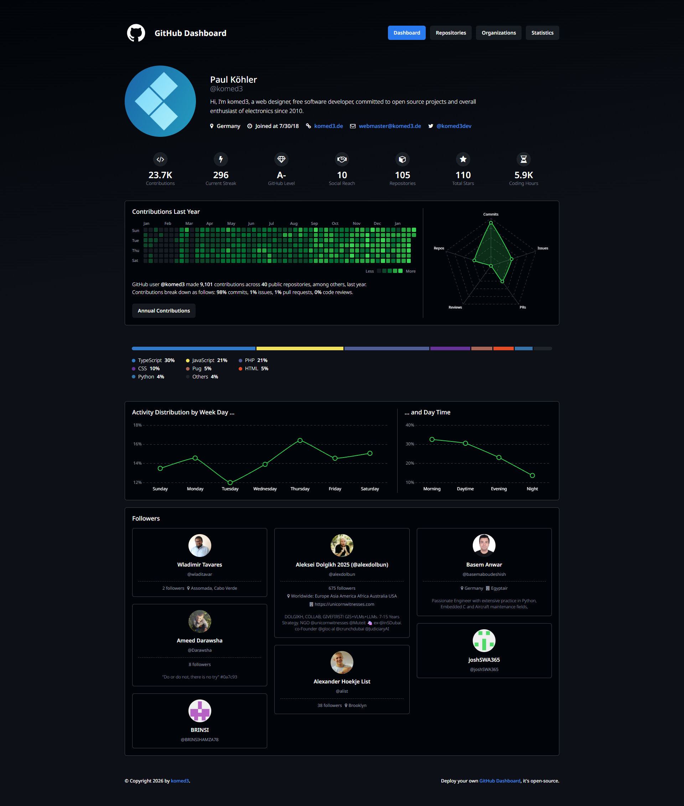

# GitHub Dashboard

GitHub Dashboard retrieves profile data via the GitHub API and uses it to generate comprehensive statistics. A personal GitHub token is required to query private data and increase the API limit.

This data is collected and analyzed:

- Profile data and daily contributions
- Followers and social reach
- Repositories and organizations
- Programming languages & skills

## Example



## Usage

Download and install `@komed3/gh-stats`

```bash
git clone https://github.com/komed3/gh-stats
cd gh-stats
npm install
```

Configure `config.yml`

```yaml
username: "<USERNAME>"
storage: "data"
privateRepos: false
compression: true
```

Get your GitHub API key

```
Profile -> Settings -> Developer Settings -> Personal access tokens (classic)
```

Generate a new classic token and grant permissions:

```
- repo
- admin:org
   - read:org
- user
   - read:user
```

Use the script to get your statistics:

```bash
$env:GH_TOKEN="..."; npm run fetchProfile; npm run fetch...
```

Get a simple server running:

```bash
python3 -m http.server 8000
```

And visit in your browser:

```bash
http://localhost:8000
```

## License

MIT © 2026 komed3 (Paul Köhler)
